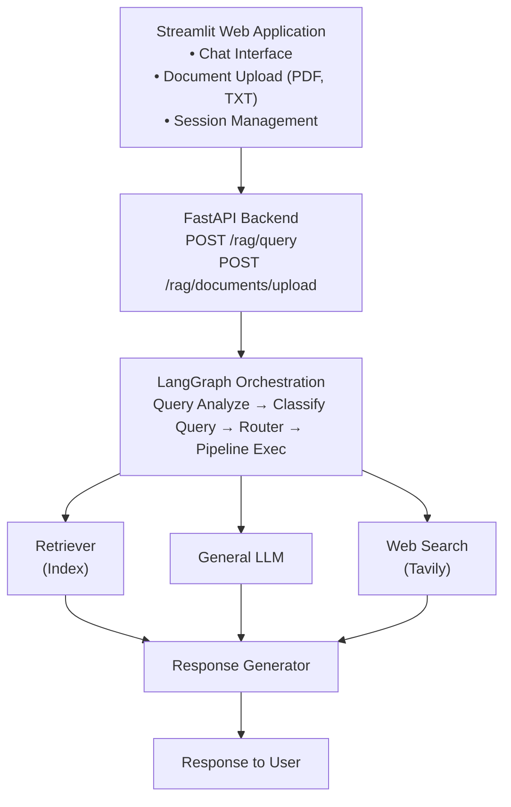

# Adaptive RAG — Agentic AI Chatbot

[](https://www.python.org/)
[](https://fastapi.tiangolo.com/)
[](https://www.langchain.com/langgraph)
[](https://qdrant.tech/)
[](https://streamlit.io/)
[](LICENSE)

**🔗 Live Demo:** [adaptive-rag-o96zpxt7kcalwrpoc5lirq.streamlit.app](https://adaptive-rag-o96zpxt7kcalwrpoc5lirq.streamlit.app/)

---

## Overview

Adaptive RAG is an intelligent, end-to-end Retrieval-Augmented Generation (RAG) system powered by an agentic AI architecture. It combines dynamic query routing, intelligent document retrieval, and advanced LLM capabilities to provide accurate, context-aware answers to user queries.

The system adapts its retrieval strategy based on query type — pulling from indexed documents, general knowledge, or real-time web search — to generate comprehensive responses. It's built with a modular architecture using **LangGraph** for workflow orchestration and multiple storage backends for scalability.

## Key Features

### Intelligent Query Routing
- **Adaptive Classification** — automatically routes queries to the most appropriate processing pipeline
- **Three Query Types:**
  - `Index` — queries answerable from uploaded documents
  - `General` — queries answerable with general knowledge
  - `Search` — queries requiring real-time web search

### Advanced RAG Pipeline
- **Document Processing** — intelligent chunking and embedding of documents
- **Vector Search** — fast similarity-based retrieval using Qdrant
- **Relevance Grading** — automatic evaluation of retrieved documents
- **Query Rewriting** — optimizes queries for better retrieval results

### Agentic AI Architecture
- **Multi-Agent System** — specialized agents for different tasks
- **ReAct Framework** — reasoning and acting pattern for intelligent decision-making
- **Tool Integration** — seamless integration with retrieval tools and web search

### State Management
- **MongoDB Backend** — persistent chat history and session management
- **Session Tracking** — individual conversation contexts per user
- **Memory Management** — full conversation context retention

### User Interface
- **Streamlit Web App** — interactive chat interface with document upload
- **File Support** — PDF and TXT document uploads
- **Real-time Feedback** — live chat with instant responses

### API-First Architecture
- **FastAPI Backend** — high-performance REST API
- **Async Operations** — non-blocking database and API calls
- **RESTful Endpoints** — well-defined API contracts

## Architecture



### Graph Nodes

| Node | Description |
|---|---|
| `query_analysis` | Analyzes and classifies incoming queries |
| `retriever` | Retrieves relevant documents from vector store |
| `grade` | Evaluates relevance of retrieved documents |
| `rewrite` | Optimizes query for better retrieval results |
| `generate` | Generates final response from context |
| `web_search` | Performs real-time web search when needed |
| `general_llm` | Provides general knowledge answers |

## Project Structure

```
AdaptiveRag/
├── src/                              # Main source code
│   ├── main.py                       # FastAPI application entry point
│   ├── api/                          # API routes and endpoints
│   │   └── routes.py                 # RAG query and document upload endpoints
│   ├── config/                       # Configuration management
│   │   ├── settings.py               # Application settings
│   │   └── prompts.yaml              # LLM prompts and system messages
│   ├── core/                         # Core utilities
│   │   ├── config.py                 # Core configuration
│   │   └── logger.py                 # Logging setup
│   ├── db/                           # Database layer
│   │   └── mongo_client.py           # MongoDB client initialization
│   ├── llms/                         # Language model integrations
│   │   └── ChatGroq.py               # ChatGroq installation
│   ├── memory/                       # Chat memory management
│   │   ├── chat_history_mongo.py     # MongoDB-backed chat history
│   │   └── chathistory_in_memory.py  # In-memory chat history (fallback)
│   ├── models/                       # Data models and schemas
│   │   ├── state.py                  # Graph state definition
│   │   ├── query_request.py          # Query request schema
│   │   ├── grade.py                  # Relevance grade model
│   │   ├── route_identifier.py       # Route classification model
│   │   └── verification_result.py    # Answer verification model
│   ├── rag/                          # RAG pipeline implementation
│   │   ├── graph_builder.py          # LangGraph workflow construction
│   │   ├── nodes.py                  # Graph node implementations
│   │   ├── retriever_setup.py        # Vector store and retriever setup
│   │   ├── document_upload.py        # Document processing and upload
│   │   └── reAct_agent.py            # ReAct agent setup
│   └── tools/                        # Utility tools and functions
│       ├── common_tools.py           # Shared utility functions
│       └── graph_tools.py            # Graph routing and decision tools
│
├── streamlit_app/                    # Streamlit web application
│   ├── home.py                       # Authentication and login page
│   ├── pages/                        # Multi-page application
│   │   └── chat.py                   # Chat interface and document upload
│   └── utils/                        # Streamlit utilities
│       └── api_client.py             # Backend API client
│
├── README.md                         # This file
├── requirements.txt                  # Python dependencies
├── CODE_STYLE_GUIDE.md               # Code formatting standards
├── QUICK_REFERENCE.md                # Quick reference guide
├── README_FORMATTING.md              # Formatting documentation
├── VERIFICATION_CHECKLIST.md         # QA verification checklist
├── FORMATTING_SUMMARY.md             # Summary of code formatting
└── DOCUMENTATION_INDEX.md            # Documentation navigation index
```

## API Endpoints

**Base URL:** `http://localhost:8000`

### 1. Query Endpoint

Process a RAG query and get an intelligent response.

```
POST /rag/query
Content-Type: application/json

{
  "query": "What is the main topic of the document?",
  "session_id": "user_session_123"
}
```

**Response:**

```json
{
  "result": {
    "type": "ai",
    "content": "Based on the document, the main topic is..."
  }
}
```

**Parameters:**
- `query` (string, required) — user's question or query
- `session_id` (string, required) — unique session identifier for conversation tracking

**Status Codes:** `200` Success · `400` Invalid request format · `500` Server error

### 2. Document Upload Endpoint

Upload documents for RAG indexing.

```
POST /rag/documents/upload
X-Description: Brief description of the document

Form Data:
- file: <PDF or TXT file>
```

**Response:**

```json
{
  "status": true
}
```

**Headers:** `X-Description` (string, required) — document description for context

**Parameters:** `file` (file, required) — PDF or TXT file to upload

**Supported Formats:** PDF (`.pdf`), Plain Text (`.txt`)

**Status Codes:** `200` Successfully uploaded and indexed · `400` Invalid file type or missing description · `500` Processing error

## 📖 Usage Guide

### 1. Prerequisites

- Python 3.9 or higher
- MongoDB (local or cloud)
- Qdrant vector database
- OpenAI API key
- Tavily API key (for web search)

### 2. Installation

```bash
# Clone the repository
git clone https://github.com/anushkaaa26/Adaptive-Rag.git
cd Adaptive-Rag

# Create virtual environment
python -m venv venv
source venv/bin/activate  # On Windows: venv\Scripts\activate

# Install dependencies
pip install -r requirements.txt
```

### 3. Environment Configuration

Create a `.env` file in the project root:

```env
# OpenAI Configuration
OPENAI_API_KEY=your_openai_api_key_here

# Tavily Search Configuration
TAVILY_API_KEY=your_tavily_api_key_here

# Qdrant Configuration
QDRANT_URL=http://localhost:6333
QDRANT_API_KEY=your_qdrant_api_key
QDRANT_CODE_COLLECTION=code_documents
QDRANT_DOCS_COLLECTION=documents

# MongoDB Configuration
MONGODB_URL=mongodb://localhost:27017
MONGODB_DB_NAME=adaptive_rag
```

### 4. Running the Application

**Start FastAPI Backend:**

```bash
# Terminal 1: Run FastAPI server
python -m uvicorn src.main:app --reload --host 0.0.0.0 --port 8000
```

**Start Streamlit Frontend:**

```bash
# Terminal 2: Run Streamlit app
streamlit run streamlit_app/home.py
```

**Access the Application:**

| Interface | URL |
|---|---|
| Web Interface | http://localhost:8501 |
| API Documentation | http://localhost:8000/docs |
| ReDoc Documentation | http://localhost:8000/redoc |
| **Live Demo (hosted)** | https://adaptive-rag-o96zpxt7kcalwrpoc5lirq.streamlit.app/ |

### 5. Example Usage

**Using the Web Interface:**
1. Navigate to the [live demo](https://adaptive-rag-o96zpxt7kcalwrpoc5lirq.streamlit.app/) or `http://localhost:8501`
2. Create an account or log in
3. Upload documents in the sidebar
4. Start chatting in the main chat area

**Using cURL:**

```bash
# Upload a document
curl -X POST http://localhost:8000/rag/documents/upload \
  -H "X-Description: Sample document about Python" \
  -F "file=@document.pdf"

# Query the RAG system
curl -X POST http://localhost:8000/rag/query \
  -H "Content-Type: application/json" \
  -d '{
    "query": "Tell me about Python",
    "session_id": "user_123"
  }'
```

**Using Python:**

```python
import requests

# Query endpoint
response = requests.post(
    "http://localhost:8000/rag/query",
    json={
        "query": "What is Python?",
        "session_id": "user_123"
    }
)
print(response.json())
```

## 🔧 Configuration

### `config/settings.py`

Core application settings loaded from environment:

- `OPENAI_API_KEY` — OpenAI API authentication
- `TAVILY_API_KEY` — web search functionality
- `QDRANT_URL` — vector database endpoint
- `QDRANT_API_KEY` — vector database authentication
- `MONGODB_URL` — chat history database

### `config/prompts.yaml`

Contains system prompts for:

- `system_prompt` — ReAct agent system instructions
- `classify_prompt` — query classification logic
- `grading_prompt` — document relevance evaluation
- `rewrite_prompt` — query optimization
- `generate_prompt` — response generation

### Query Routing Logic

The system routes queries based on classification:

```
Query Classification
├── "index"   → Use retriever (indexed documents)
├── "general" → Use general LLM (common knowledge)
└── "search"  → Use web search (real-time information)
```

## 🧪 Testing the API

**Using FastAPI Interactive Documentation:**
1. Navigate to `http://localhost:8000/docs`
2. Expand endpoint sections
3. Click "Try it out"
4. Enter test data
5. Click "Execute"

**Example Test Cases:**

```json
// Test 1: Simple Query
{
  "query": "Hello, how are you?",
  "session_id": "test_user_1"
}

// Test 2: Document-Based Query
{
  "query": "What topics are covered in the uploaded document?",
  "session_id": "test_user_1"
}

// Test 3: General Knowledge Query
{
  "query": "What is machine learning?",
  "session_id": "test_user_1"
}
```

## Security Considerations

- Store API keys in `.env` file (never commit)
- Use environment variables for sensitive data
- Implement rate limiting for production
- Validate all user inputs
- Use HTTPS in production
- Implement authentication/authorization
- Secure MongoDB with proper credentials

## Deployment

**Local Development:**

```bash
python -m uvicorn src.main:app --reload
```

**Production Deployment:**

```bash
python -m uvicorn src.main:app --host 0.0.0.0 --port 8000 --workers 4
```

**Docker Support (Optional):** create a `Dockerfile` and `docker-compose.yml` for containerized deployment.

## 📊 Performance Optimization

- **Document Chunking** — configurable chunk size (1000 chars, 150 overlap)
- **Vector Search** — efficient similarity search with Qdrant
- **Async Operations** — non-blocking I/O for better throughput
- **Caching** — query results cached when applicable
- **Batch Processing** — document processing in batches

## Contributing

Contributions are welcome! Please follow these steps:

1. Fork the repository
2. Create a feature branch (`git checkout -b feature/YourFeature`)
3. Make changes following `CODE_STYLE_GUIDE.md`
4. Commit with descriptive messages (`git commit -m 'feat: Add YourFeature'`)
5. Push to your branch (`git push origin feature/YourFeature`)
6. Open a Pull Request

**Code Quality:**
- Follow PEP 8 standards
- Add docstrings to all functions
- Write unit tests for new features
- Update documentation
- Run linting: `flake8 src/`

## Technology Stack

| Component | Technology | Version |
|---|---|---|
| LLM Framework | LangChain | ~0.3.27 |
| Workflow Orchestration | LangGraph | ~0.5.4 |
| Web Framework | FastAPI | Latest |
| ASGI Server | Uvicorn | Latest |
| UI Framework | Streamlit | Latest |
| Vector Database | Qdrant/FAISS | Latest |
| Chat Database | MongoDB/InMemory | Latest |
| Document Processing | LangChain Community | ~0.3.27 |
| LLM Provider | OpenAI | ~0.3.28 |
| Web Search | Tavily | Latest |
| Async DB | Motor | Latest |
| Data Validation | Pydantic | ~2.11.7 |

## Documentation References

- `CODE_STYLE_GUIDE.md` — comprehensive coding standards
- `QUICK_REFERENCE.md` — quick patterns and templates
- `README_FORMATTING.md` — code formatting overview
- `VERIFICATION_CHECKLIST.md` — QA checklist
- `DOCUMENTATION_INDEX.md` — full documentation index

## FAQ

**Q: How do I upload multiple documents?**
A: Upload one document at a time through the Streamlit interface. Each upload creates a new indexed collection.

**Q: What's the maximum file size?**
A: Limited by system memory and Qdrant storage. Typical limit is 100MB per file.

**Q: Can I use different LLM providers?**
A: Currently configured for OpenAI. You can modify `src/llms/openai.py` to use other providers.

**Q: How is conversation history stored?**
A: MongoDB stores all chat messages with timestamps and session IDs for full context retention.

**Q: Can I run this without web search?**
A: Yes — remove the Tavily dependency. Queries will use index or general LLM only.

## Support & Contact

For issues, questions, or suggestions:
- Open an [Issue](https://github.com/anushkaaa26/Adaptive-Rag/issues)
- Check existing documentation
- Review the code comments

## Acknowledgments

Built with LangChain and LangGraph · Vector search powered by Qdrant · LLM capabilities by OpenAI · Web search by Tavily · UI powered by Streamlit · thanks to the open-source community.

## License

This project is licensed under the MIT License — see the [LICENSE](LICENSE) file for details.

---

## Project Status

✅ Core RAG pipeline implemented
✅ Document upload and indexing
✅ Query routing (index/general/search)
✅ MongoDB chat history
✅ Streamlit web interface
✅ Code formatted and documented
🚀 Production ready

### Roadmap

- [ ] Enhanced context management
- [ ] Multi-language support
- [ ] Performance benchmarks
- [ ] Extended LLM provider support
- [ ] Advanced authentication
- [ ] Real-time collaboration
- [ ] Analytics dashboard
- [ ] Cost optimization

**Status:** ✅ Production Ready &nbsp;|&nbsp; **Documentation:** ✅ Comprehensive
